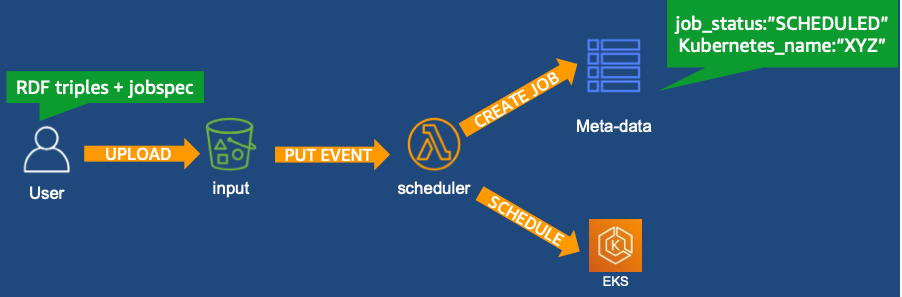
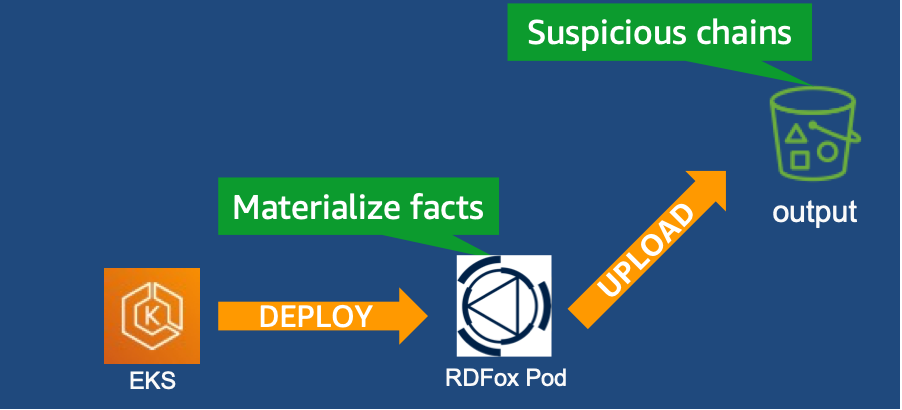
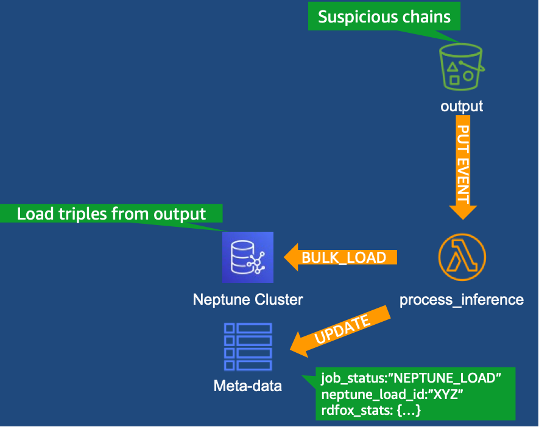
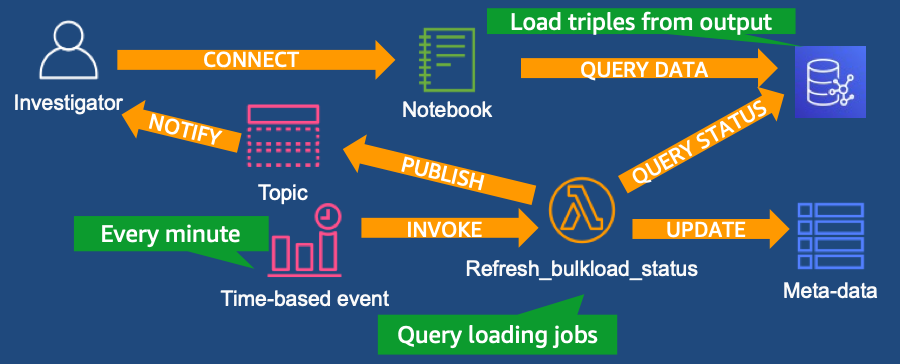
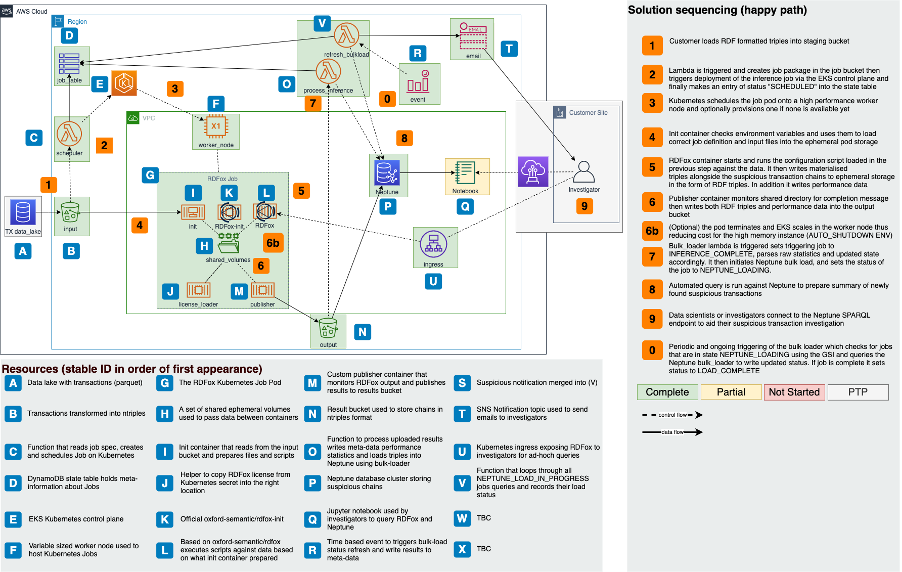

# AWS graphreasoning-pipeline
> An automated pipeline to drive Oxford Semantic (OST) RDFox to perform batch based inferencing to discover suspicious transactions across payment transactions and store them persistently in Amazon Neptune

## Security

See [CONTRIBUTING](CONTRIBUTING.md#security-issue-notifications) for more information.

## License

This library is licensed under the MIT-0 License. See the LICENSE file.


## Important note and pre requistes

### RDFox licensing
**This solution requires you to have a valid license for Oxford Semantic Technologies (OST) RDFox.** 

This repo does not contain any code or assets owned by OST.You can deploy the solution end-to-end in an AWS account using the provided infrastructure automation, but unless you have access to an RDFox license the inference containers will fail to start. Please contact OST for a trial license https://www.oxfordsemantic.tech/tryrdfoxforfree .

### Test Data
The purpose of this solution is to process large volumes (TBs) of data as a consequence we didn't include any in this repository. This repo includes code and instructions on how to use the deployed infrastructure to generate your own test data sets of desired size and complexity. See further down.

## Solution overview

The solution is a batch-based graph data ingestion and reasoning pipeline. The solution is based on a distributed asynchronous event-driven architecture comprising the following modules.

### Ingestion module

This is an event-driven process that takes in a set of files containing RDF triples, queries, and RDFox ‘dlog’ inference files. The module analyses the contents of a ‘jobspec’ json formatted file which governs parameters such as the number of CPU cores and memory that should be used as well as input and output locations. It records and uses this information to construct and schedule a Kubernetes ‘Job’ on an Amazon EKS cluster to perform reasoning.
 


###	Reasoning module
Processing and reasoning occurs within a Kubernetes Job pod containing RDFox and helper containers.

First, an ‘init’ container in the pod pulls down the data from S3 and copies it into temporary storage. Then RDFox loads the input triples into memory, applies the dlog reasoning rules to infer new facts/triples, and finally runs the queries to extract the relevant materialized facts as triples. Once inference is complete, a publisher container copies the results and performance log into the Amazon S3 output bucket. It should be noted that this component is ephemeral in nature and once the Job is deleted all internal state is lost.

This module has optional configuration settings to retain and expose the RDFox instance post-inference. Doing so permits investigators to connect directly to the RDFox console to perform additional inference or analysis on the data in memory.


###	Persistence module
This module processes the log file to derive performance and meta-data characteristics before going on to perform a bulk-load from S3 into an Amazon Neptune cluster. Unlike the Job, the cluster is persistent and can scale capacity up to 64 TiB. By persisting the outputs in this cluster, the results of previous runs can be retained and used by financial investigators.


###	Load status and notification module
The bulk load into Neptune is an asynchronous process and the status API can be used to check on progress. The module periodically polls the Neptune loader API for all “in-progress” load jobs at configurable intervals. Once a job transitions to “complete” or “failed” status it records and evaluates the statistics (such as load performance and number of triples) and records the job as “complete”.

On complete load, it also sends a notification to a configurable distribution list informing of the load statistics and encouraging investigators to take action to review the findings.


##	Infrastructure Architecture
The conceptual modules are all implemented using AWS and Kubernetes resources. The following diagram depicts resources and their relation to each other


##	Kubernetes Job Pod Architecture
As described previously, the reasoning module is realized using a Kubernetes Job. This job pod comprises the following functionally relevant containers.
 
### Container functionality
The solution comprises three containers that collaborate to satisfy the use case.

* Pre-RDFox – the container responsibility is to load the data from the bucket source directory, and create a customer RDFox script which will have all the source files, rules, and queries RDFox needs to process. The resulting script will be saved under the mount of /scripts. The dynamic script generation is necessary as it needs to be adjusted for the exact input, inference and query files.
* RDFox – the actual RDFox instance container which processes the custom script created above. The output of the script is stored on the mount of /output which includes the queries result files. In addition, all stdout and stderr is captured in a log file.
* RDFox Publisher – This container runs and monitors the output mount directory log file. Once a string signifying RDFox completion is detected, the container copies the output directory to the destination bucket location.

###	Container parameters and Environment variables

The behavior of the components within the pod are controlled via environment variables. These variables are dynamically injected into the specification by the orchestration engine. The environment variables and their significance to each container are as follows. Please note that variables are set per container so two containers can have the same variable with different values.
* Pre-RDFox
** BUCKET_NAME – the bucket name to load the data from.
** DATA_PATH – the sub-directory in the bucket to load the data from.
** AUTO_SHUTDOWN – a flag to indicate if the instance should shut down after processing or remain active (True/False).
** JOB_ID – the job ID of the current execution so that the corresponding results could be output to.

The behavior of RDFOX is chiefly controlled by the content of the script dynamically generated by “Pre-RDFox”. The notable exception is the configuration of credentials to the API endpoint which are governed by the following environment variables defined by the RDFOX documentation. Note: For security the RDFOX_PASSWORD is seeded into the container indirectly via a Kubernetes Secret.
* RDFOX_ROLE
* RDFOX_PASSWORD

RDFox Publisher
* BUCKET_NAME – the name of the bucket results are to be copied to.
* DATA_PATH – the sub-directory to copy the triple result in the output bucket.
* JOB_ID – the job id of the current execution – this will be used as the directory for all the results.

RDFox Data workflow
* The starting point bucket should retain all data and RDFox artifacts in a single sub-directory.
* The container script copies all content of the sub-directory to the local pod disk: /data mount.
* The Pre-rdfox container generator script segregates data files, rules, queries. 
* For each data file (nt): a custom loader script is created.
* For each rules file (dlog): a custom rule and materialization is appended to the script.
* For each query file (rq): a custom query execution is appended to the script.
* The custom script is copied to the /scripts mount.

In essence, for a data analyst to try a different rule or query is simply dropping the file to the source bucket directory and the code will automatically pick it up and run it against the dataset.

Once RDFox container execute the custom script above, the result will be placed on the /output mount directory.

RDFox publisher is copying all the output directory content to the configured output bucket/jobID.

## Deploying / Getting started

### 0. Pre-requisites
In order to execute this guide please ensure you have installed the following

* "poetry" and Python 3.7
* terraform
* git
* docker

### 1. Deploy Terraform backend

Note that the bootstrap only needs to be deployed once per account. 

To install the bootstrap, you only need to follow the below steps. However, for more details about the bootstrap deployment you can refer to this [Github page](https://github.com/trussworks/terraform-aws-bootstrap).

1.  Open the directory and edit variables

```
cd ../rdfox-neptune-graph-reasoning/infrastructure/graphreasoning-dev/bootstrap
```
Duplicate the template variable file .tfvars, remove the license header and enter your variables values.

Then, store your filename in your shell:
```
export BOOTSTRAP_VAR_FILE=<filename>
export AWS_DEFAULT_REGION=ap-southeast-1 # (or wherever you are deploying)
```

2. Now, bootstrap the Terraform state backend:

```
mkdir plans
terraform init && terraform plan --var-file=$BOOTSTRAP_VAR_FILE -out plans/plan.out
terraform apply plans/plan.out
```

Once terraform is applied, login to AWS console, you should see two new S3 buckets _<account_alias-tf-state-<region>_ and a DynamoDB table called “terraform-state-lock”.

Store the name of the generated bucket in your environment variable like so
```
export TF_VAR_tf_state_bucket=NAME_OF_THE_BUCKET_CREATED
```

The environment should now be ready for the infrastructure deployment.

### 2. Infrastructure pre-deployment steps

Since Terraform will deploy the whole infrastructure at once, there are a few pre-requisites to fill in before the deployment.

1. Create IAM role - _Optional_

In order for Terraform to deploy the infrastructure, you need to assign a role. You can either keep the same role you used to configure the backend (bootstrap section), or you can create a new role.

2. Build package to run the jobs on rdfox *(pre-requisite - poetry must be installed locally)*

From your cmd:


```
cd neptune_load
poetry build
```

```
cd rdfox-neptune-graph-reasoning/pipeline_control
poetry install
make bundle.cloud
```

A zip file will be created in *rdfox-neptune-graph-reasoning/pipeline_control/dist/*
This package will be later uploaded to S3 and pulled by the Lambda functions to process jobs.

3. Add your TLS certificate to Certificate Manager (ACM) and create a CNAME record - _Optional_

**Warning: While optional, skipping this step will result in your RDFox endpoint being exposed over HTTP (i.e. UNENCRYPTED)**

When installing a TLS certificate, you can either bring your own certificate and import it into ACM or generate a new certificate in ACM. Both options are achievable from the console and the CLI.
To import your own certificate, only refer to step 1 (either Console or CLI).
To generate a new certificate, only refer to step 2 (either Console or CLI).


- From the AWS console:

Go to Certificate Manager and do either of the following:

    1. Import your certificate:
        * Click on Import Certificate and enter the details.
        
    2. Generate a certificate:
        * Click on Provision Certificates.
        * Follow the instructions.
            * Note: To ensure you cover the Rdfox URL, the certificate must cover all hostnames within your DNS domain name. Therefore, the ACM domain should contain a wildcard (i.e.“*.domain_name”) in order to secure any hostnames within that domain.
        * Once the verification will be approved, the certificate will be become active.

 - From the AWS CLI, use the following commands:

    1. Import your certificate:

    ```
    aws acm import-certificate --certificate fileb://Certificate.pem --certificate-chain fileb://CertificateChain.pem --private-key fileb://PrivateKey.pem 	
    ```

    Where:
        * The PEM-encoded certificate is stored in a file named Certificate.pem.
        * The PEM-encoded certificate chain is stored in a file named CertificateChain.pem.
        * The PEM-encoded, unencrypted private key is stored in a file named PrivateKey.pem.

    2. Generate a certificate:

    ```
    aws acm request-certificate --domain-name www.example.com --validation-method DNS --idempotency-token 1234 --options CertificateTransparencyLoggingPreference=DISABLED
    ```
    Where:
        * domain-name is your domain
        * validation-method should be either DNS or EMAIL (in both cases, you need to have access to be able to validate from there)

To add more attributes to your certificate, you can find more details on the arguments [here](https://docs.aws.amazon.com/cli/latest/reference/acm/request-certificate.html).


In both cases, the output will return the ARN of the certificate.

4. Add RDFox license.

The Rdfox license must be base64 encoded in RDFox.lic. 

Upload your license into a **.txt** file in the directory you wish, you will update the license_path variable with the correct directory path in the next section.
Once pulled from the RDFox module, the license file will then be base64 encoded before being pushed into RDFox.

Note: Your container will keep on crashing if you don't do this as RDFox won't start unless the correct license has been provided. 

5. Edit variables.

In _infrastructure/graphreasoning-dev/graphreasoning-dev/_ directory, duplicate the template variable file .tfvars, clean up the license head part, and input your variables values.

The following variables must be edited:

* deployment_role
* target_account
* target_region (if different region)
* trusted_prefixlists
* dev_public_key (the public key of the SSH key used for this instance) - Conditional if create_dev_instance=true
* dev_security_allowed_ingress (this should be the IP from which you will login to the instance)
* email (the email address subscribed to the SNS topic of the Lambda bulk load refresher, to receive periodic notifications)
* worker_node_instance_type (if changing region)
* acm_cert (the arn of the certification you created/imported into ACM previously)
* license_path (path to the license file created in previous section)

The remaining variables can be edited based on your requirements.
 
Then, store your filename in your shell:
```
export VAR_FILE=<filename>
```


6. Edit the backend variables.

In the infrastructure/graphreasoning-dev/graphreasoning-dev/ directory, edit the variable file *terraform.tf.*

Update the following variables with the correct values:

* bucket (name of your tf-state S3 bucket setup during bootstrap)
* role_arn (arn of the iam role created/used to setup the backend)
* session_name


This will allow Terraform to know which backend to use.

7. ASG Role - _Optional (only if you already have one)_

If you already configured an auto scaling group in the same account previously, you should already have the AWS IAM Role setup and therefore do not need to create a new one.

To import it:

```
terraform import --var-file=$VAR_FILE aws_iam_service_linked_role.autoscaling arn:aws:iam::<ACCOUNTID>:role/aws-service-role/autoscaling.amazonaws.com/AWSServiceRoleForAutoScaling
```
### 3. Infrastructure deployment steps

Set the variable name for the role you are using to deploy

```
export TF_VAR_deployment_role="arn:aws:iam::ACCOUNT_ID:role/ROLE_NAME"
```

Initialise the deployment state by running:

```
cd rdfox-neptune-graph-reasoning/infrastructure/graphreasoning-dev/graphreasoning-dev \
terraform init -backend-config="bucket=$TF_VAR_tf_state_bucket" -backend-config="role_arn=$TF_VAR_deployment_role" -backend-config=backend_config
```

If successful, run the below to create a terraform execution plan:

```
mkdir plans
terraform plan --var-file=$VAR_FILE -out plans/plan.out
```

The plan will display all the configurations that will be applied to your AWS environment. Review them and once happy apply them, by running:

```
terraform apply plans/plan.out
```

### 4. Infrastructure post-deployment steps

1. For the EKS AutoScaler to work, it needs to be mapped to your existing AutoScaling Groups. In order to do that, you will need to add the following tags to the AutoScaling Group:
<p>**"k8s.io/cluster-autoscaler/${module.eks_cluster.cluster_id}" = "owned"<br/>
"k8s.io/cluster-autoscaler/enabled" = "TRUE"**</p>

Make sure you replace _${module.eks_cluster.cluster_id}_ by the name of your EKS cluster.


2. Create a DNS record - _Optional_ (only if you created/stored a certificate in ACM in the pre-deployment steps section)

On the AWS console, go to EC2 Dashboard then Load Balancer, and look for the DNS name of the Kubernetes Ingress Load balancer.

Then, go to your DNS Provider and create a CNAME record within the domain you created the TLS certificate for.

i.e.
|Name                 |Value                |
|---------------------|---------------------|
|newname.newdomain.com|k8s.xxx.amazonaws.com|   

3. Store output values into local shell

Create a shell variable for the RDFox namespace name you created:

```
export RDFOX_NAMESPACE=<namespace>
```

Then, open the Terraform output file deploy-plan.out and look for the following output values and store them into variables as below:

```
export EKS_CLUSTER=<cluster_name>
export S3_FILE_BUCKET=<file_bucket>
export INPUT_BUCKET=<triple_store>
export OUTPUT_BUCKET=<output_store>
```

## Test your deployment

### 1. Push container scripts into ECR repositories

For each script, you will need the account ID and the region, so let's export them first:

```
export ACCOUNT_ID=<account_id>
export REGION=<region>
```

Now run the scripts:

```
cd container_scripts/post_rdfox
./ecr_archive.sh
```

```
cd container_scripts/pre_rdfox
./ecr_archive.sh
```

```
cd container_scripts/rdfox_custom
./ecr_archive.sh
```


### 2. Generate some test data (optional)

If you don't have your own transaction and counterparty data you can use the included script to generate some yourself. 
Our data generator uses the EKS cluster to generate data using a script based on the python "faker" library. Optionally you can run this outside of the cluster, but the process for this out of scope of the documentation

#### 1. Build and push the data generator image.
```
cd container_scripts/data_generator
./ecr_archive.sh
```

Once built you can use the "3_data_generator" control script to trigger the generation of the data.

First, decide the parameters governing data generation. As of now the options are 

Options:
  --cores INTEGER <-- number of cores to use for generation. More cores faster performance
  --memory INTEGER <-- memory to allocate to generation. Larger sets will require more memory
  --parties INTEGER <-- number of counterparties to include in the data set
  --thread-count INTEGER <-- number of threads to use for computation. Certain aspects can be parallelised
  --chain-days-range INTEGER <-- 
  --max-days-before INTEGER <--
  --transactions INTEGER <-- number of transactions in the set 
  --data-set TEXT <-- the name of the data set. We suggest the convention PREFIX-XMT-YKP where this means X million transactions and Y thousand parties. Take care not to include "_" in this as it can break the inference. The data set will be generated in bucket/data-set 
  --kubernetes-cluster TEXT <-- the name of the kubernetes cluster to deploy against
  --bucket TEXT <-- the bucket that will contain the generated data

We recommend exporting the data set name to avoid typos

```
export DATA_SET=TESTSET-10KT-1KP
```

```
cd pipeline_control
poetry run python -m pipeline_control.control_scripts.3_data_generator --data-set $DATA_SET --bucket $INPUT_BUCKET --kubernetes-cluster $EKS_CLUSTER --transactions 10000 --parties 1000
```

The script is interactive and will tail the container logs. Depending on the size of the job and the cpu allocated this will take between minutes and hours. We recommend using a small set to test initially.

Once the script is complete you will see the files have been populated in the bucket in the form of *.nt files

You are now ready to use them to run experiments with.

### 3. Copy triples into source bucket

Upload your data, dlog and queries into the source bucket, into a folder in the input bucket. This folder could be the the location you used to generate data into in step 2.

_Note: You need to have Docker installed to run Docker commands._

### 4. Run a test job

Now you can run a job by doing the following:

```
cd performance_testing/job_submitter/
poetry run python job_submitter.py --data-set $DATA_SET --cores 3 --memory 5 --auto-shutdown False --input-bucket=$INPUT_BUCKET --output-bucket=$OUTPUT_BUCKET --account-id=$ACCOUNT_ID
```

* enter the bucket names of your input bucket (the one used for Lambda Scheduler) and output bucket (the one used for Lambda Process Inference)
* account_id should be the ID of the account where you run the jobs
* replace the number of cors and memory by your values

From the AWS console, you can look at:
* EKS cluster to see a new pod being spun up and going through container deployment steps
* EC2 console to see new EC2 instances being triggered by the EKS autoscaler if additional cpu is needed
* DynamoDB to see the latest job ran with a job_id and a job result that should display SUCCESS_NOTIFICATION_SENT
* Lambda logs to see the job being detected

## Additional notes

* SNS subscription doesn’t work with Terraform since it basically waits for the subscriber’s confirmation in order to set it up and as a result, breaks the process. Alternatively we use a Cloudformation stack into our Terraform modules [here](https://github.com/zghafari/tf-sns-email-list)

* ALB needs custom role bindings "kubectl apply -k "github.com/aws/eks-charts/stable/aws-load-balancer-controller//crds?ref=master (http://github.com/aws/eks-charts/stable/aws-load-balancer-controller//crds?ref=master)".

* When editing the EKS worker node instance type on a running instance:
    * make sure you use an instance type that exists in your region.
    * make sure you reboot the instance after applying your terraform.

* To check that the correct license and encoding have been uploaded into RDFox, you can run the following command:

```
 kubectl edit secret --ns $RDFOX_NAMESPACE rdfox-license 
```

